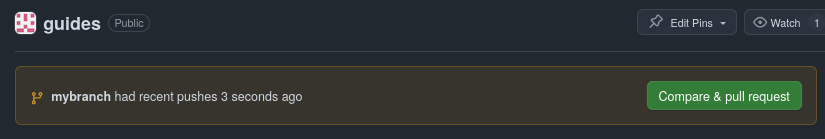

# [guides @ CSTAR](https://reed-cstar.github.io/guides/)

This repository contains documentation on common tools that you may come across in your computer science
education here at Reed, bundled together in a [convenient webpage](https://reed-cstar.github.io/guides/) rendered with [mdBook](https://github.com/rust-lang/mdBook).

## Contributing

All of the content in this repository is typed with [Markdown](https://en.wikipedia.org/wiki/Markdown): to make contributions to this repository, follow the following steps:

### Step 1. Fork & Clone

> **Note**: [You will need a GitHub account](https://github.com/signup) to complete your contribution to `guides`.

This will get the code from GitHub down to your computer. If you aren't a CSTAR member, you will need to [fork the Reed-CSTAR/guides repository](https://github.com/Reed-CSTAR/guides/fork) and clone the repository using [git](https://git-scm.com/):

```sh
# Make sure to run this in a folder that you'll remember!
git clone git@github.com:username/guides.git
cd guides
git remote add upstream https://github.com/Reed-CSTAR/guides.git
git fetch upstream
```

Once you cloned the repository, you should switch to a new branch to isolate your changes, in case you make more in the future:

```sh
git checkout -b mybranch
git push --set-upstream origin mybranch
```

You should also authenticate with Git - a page in the guide will appear about this soon.

### Step 2. Install mdBook

You will need to install [mdBook](https://rust-lang.github.io/mdBook/guide/installation.html), the tool we use to render markdown into a website, onto your computer.

### Step 3. Preview

To see your changes locally, in your terminal, run:

```sh
mdbook serve
```

### Step 4. Make a pull request

Make sure you commit & push your current changes to your branch.

This next step is quite hard to do in the terminal unless you have the [GitHub CLI](https://cli.github.com/), so we will return to the [repository page on GitHub](https://github.com/Reed-CSTAR/guides).

If you successfully pushed to your branch, you should see an indicator as so:



If not, you can always explicitly click the "New Pull Request" button in the `Pulls` tab:


When making a pull request, be sure to give it an appropriate title, which should be a brief 1-line summary of your changes, and a description, which should go as in-depth as appropriate.
