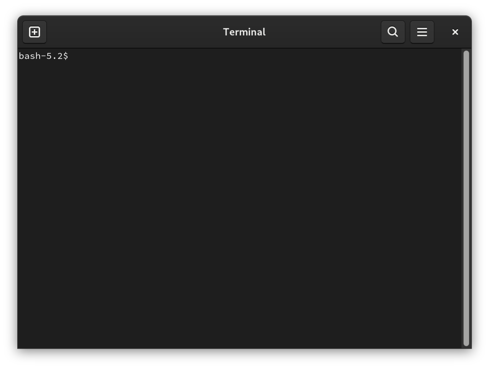
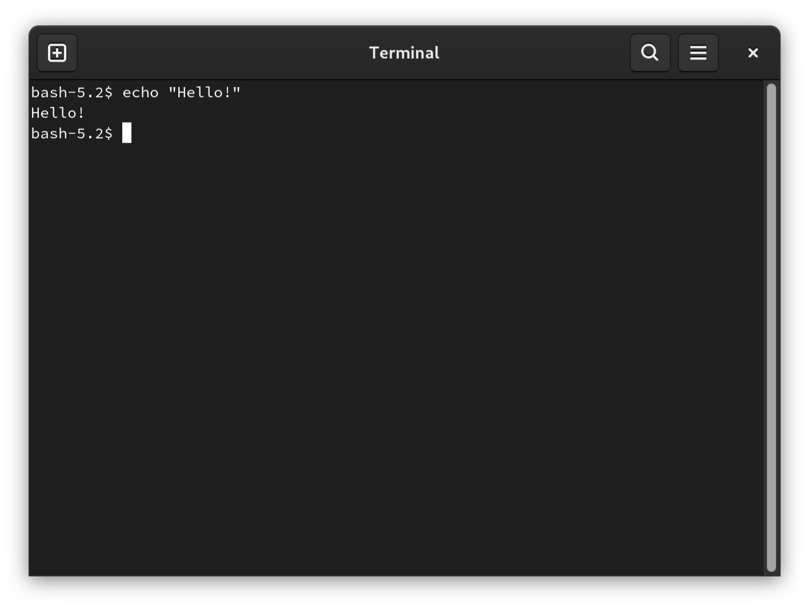

# Linux

You've probably got an app called "Terminal" installed. Look for it in your
launcher. You'll get an interface like this:

You can type and run **shell commands** at this prompt:

That's all there is here! Go to learn the [basics](../basics.html).
