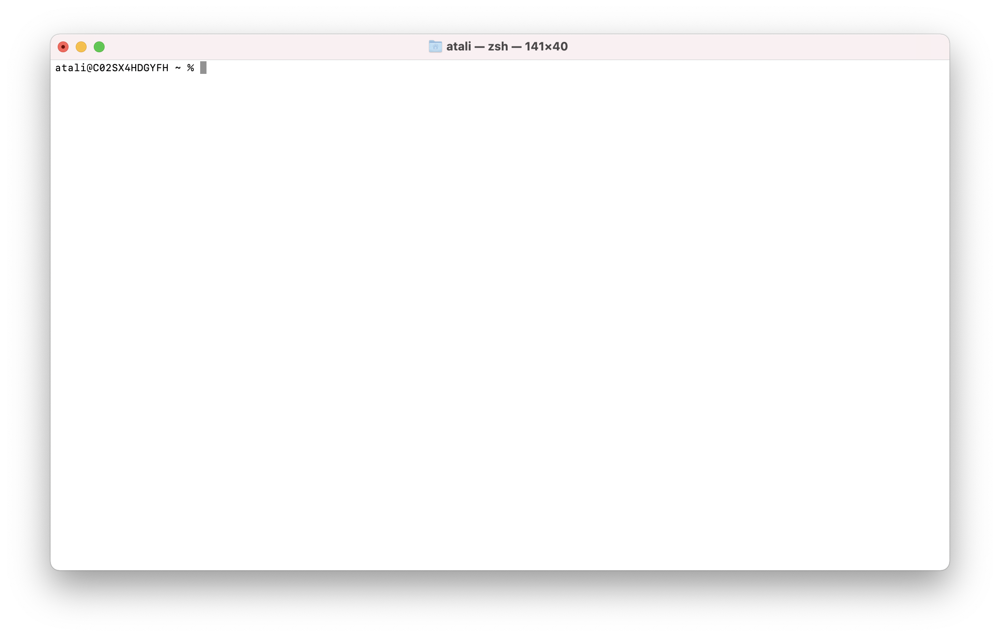

# MacOS

You've already got a terminal: Press <kbd>⌘+SPACE</kbd> to open Spotlight, and
type `terminal` to open the terminal. You'll see something that looks something
like this:

Where other operating systems use a shell called Bash, MacOS uses zsh by
default. For our purposes here, these shells work mostly the same way, but parts
of this guide (especially the scripting section) refers to Bash instead of zsh.
This is unlikely to ever be important, but it's something to keep in mind.